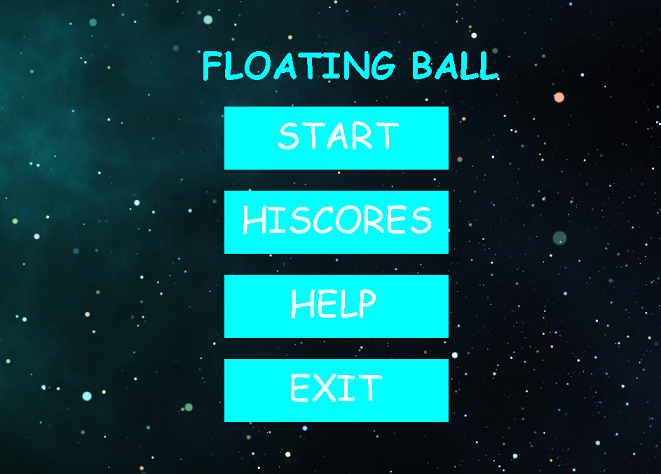
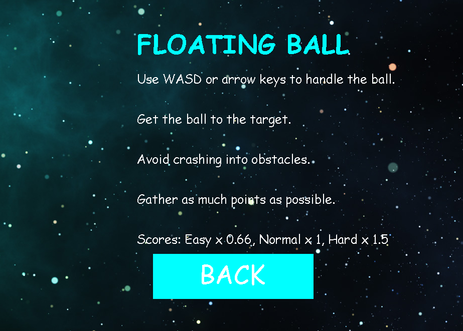
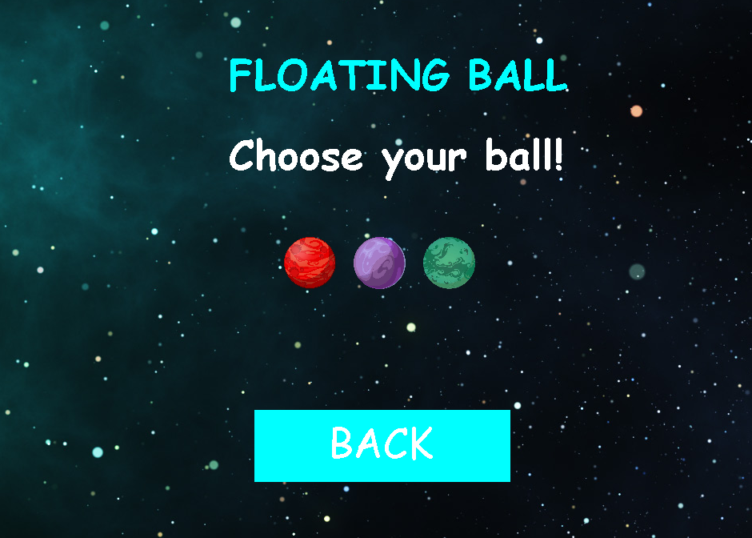
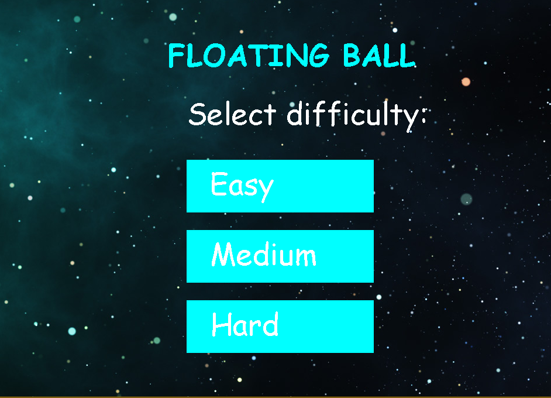
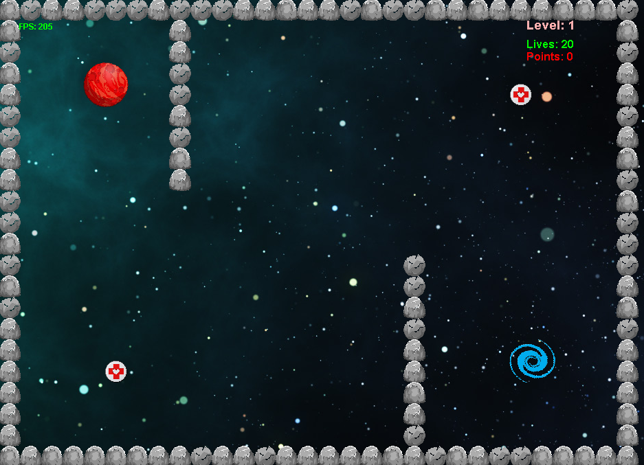
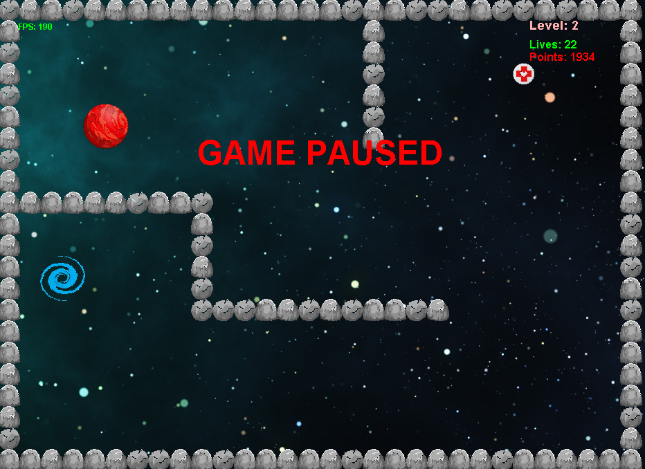
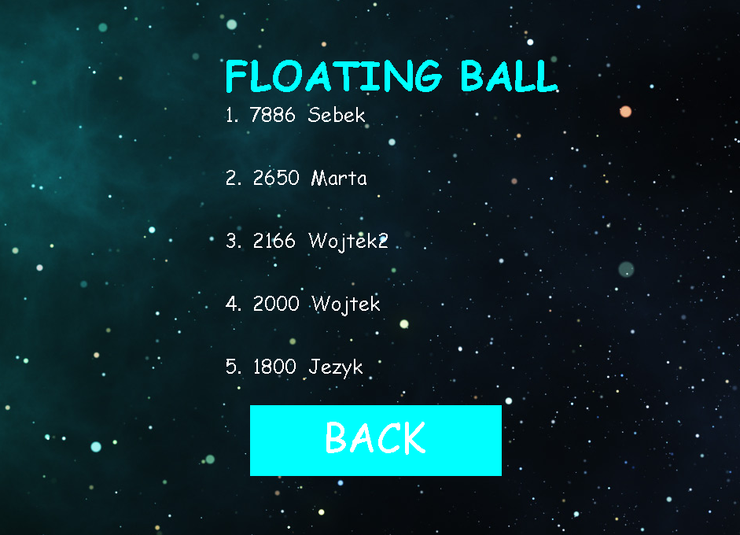

# Floating Ball
* Introduction
* Manual
* Server
* Game demonstration

## Introduction
The game was programmed by Sebastian Jakubaszek and Wojciech Jenczalik.

I am glad that you are looking  at this file.  This game was our project at Warsaw University of Technology and was programmed in Java .  I know that the code isnt clean, but it was our first steps in Java.

## Manual
You can control the ball using W, A, S, D or arrow keys. 
Press P pause the game. Press again P start the game.

The goal of this game is avoid crashing into obstacles and getting to portal as fast as possible, what ends level and starts next.

## Server 
Our project based on a client-server model. If the client is connected to the Internet, gets the levels and the best list of results from the server. Moreover, if a player wins the game or loses all his life, his result is sent to the server, which compares this result with the results from the best list. If the result is better than them, the server adds it and removes the weakest result.

## Game demonstration

